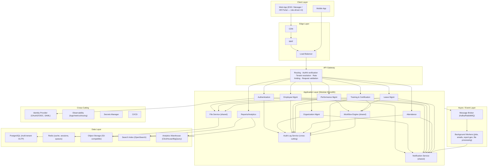
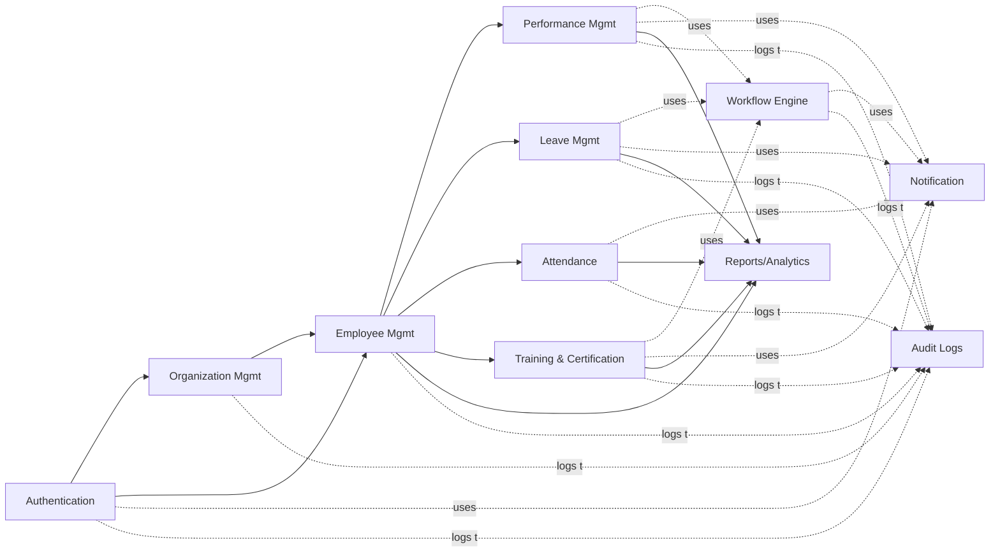

# Multi-Tenant HRMS SaaS — Phase 1 Architecture

## 1. System Architecture

Recommended approach: **modular monolith at launch, service-ready boundaries for future extraction**. This avoids premature microservices overhead while keeping each module (Auth, Org, Employee, Performance, Leave, Attendance, Training, Reports) independently deployable later.



**Design rationale**
- **Modular monolith**: single deployable unit, but each module owns its own tables/services and communicates via internal interfaces — not direct cross-module DB access. This makes future extraction to microservices (e.g., splitting Reports or Notification first, since they're natural bottlenecks) low-risk.
- **Event-driven backbone**: domain events (`EmployeeCreated`, `LeaveApproved`, `AppraisalSubmitted`) are published to the broker so Notification, Audit, and Reports stay decoupled from the modules that trigger them.
- **Separate OLTP vs OLAP**: dashboard analytics reads from a warehouse fed by CDC/ETL from Postgres, protecting transactional performance.

---

## 2. Database Architecture

**Engine**: PostgreSQL (strong RLS support, JSONB for flexible custom fields per tenant, mature ecosystem).

**Multi-tenancy model**: hybrid — pooled (shared schema + `tenant_id`) by default, with silo (schema-per-tenant or DB-per-tenant) available for enterprise/regulated customers. Detailed in Section 4.

### Core Schema Domains

| Domain | Key Tables |
|---|---|
| **Tenancy** | `tenants`, `subscriptions`, `tenant_settings`, `tenant_feature_flags` |
| **Identity** | `users`, `roles`, `permissions`, `role_permissions`, `user_roles`, `sso_configs`, `sessions` |
| **Organization** | `business_units`, `departments`, `designations`, `locations`, `org_hierarchy` |
| **Employee** | `employees`, `employment_history`, `employee_documents`, `employee_custom_fields` |
| **Performance** | `review_cycles`, `goals_okrs`, `appraisals`, `appraisal_ratings`, `feedback_360`, `competency_framework` |
| **Leave** | `leave_types`, `leave_policies`, `leave_balances`, `leave_requests`, `holiday_calendars` |
| **Attendance** | `shifts`, `attendance_logs`, `timesheets`, `regularization_requests` |
| **Training** | `courses`, `certifications`, `enrollments`, `training_completions` |
| **Workflow** | `workflow_definitions`, `workflow_instances`, `workflow_steps`, `approval_actions` |
| **Notification** | `notification_templates`, `notification_logs`, `notification_preferences` |
| **Audit** | `audit_logs` (append-only, partitioned) |
| **File** | `file_metadata`, `file_access_grants` |

### Conventions
- Every tenant-scoped table carries `tenant_id UUID NOT NULL` with a composite index `(tenant_id, id)` and PostgreSQL **Row-Level Security** policy filtering on it.
- Soft deletes (`deleted_at`) for employee-facing entities; hard deletes disallowed for audit-relevant tables.
- High-volume, append-heavy tables (`audit_logs`, `attendance_logs`, `notification_logs`) are **range-partitioned by month** and further sharded by `tenant_id` hash for large tenants.
- Read replicas serve `Reports` and dashboard queries; writes always go to primary.
- JSONB columns (`custom_fields`) allow tenant-specific field extensions without schema migrations per tenant.

---

## 3. Module Dependency Diagram



**Rules encoded here**
- `Authentication` and `Organization Management` are foundational — everything depends on them, directly or transitively.
- `Employee Management` is the hub; Performance, Leave, Attendance, and Training all attach to an employee record but never depend on each other directly.
- `Workflow Engine`, `Notification`, and `Audit Logs` are **shared services**, not business modules — other modules call into them, never the reverse.
- `Reports` is strictly a consumer (read-only) of every business module — it never writes back.

---

## 4. Tenant Isolation Strategy

### Default tier — Pooled (shared DB, shared schema)
- Every table has `tenant_id`; Postgres **Row-Level Security** policies enforce `tenant_id = current_setting('app.tenant_id')` on every query.
- The API Gateway resolves tenant from subdomain (`acme.hrms.io`) or custom domain, validates it against the `tenant_id` claim embedded in the JWT, and the application sets the Postgres session variable per request — no query can accidentally cross tenants even on a developer error, since RLS is enforced at the DB engine, not just app logic.
- Connection pooling (PgBouncer) is tenant-agnostic; the session variable is set immediately after checkout.

### Enterprise tier — Silo (schema-per-tenant or DB-per-tenant)
- For customers with compliance requirements (data residency, dedicated backup/restore SLAs), provision a dedicated schema or database.
- A **tenant router** at the data-access layer resolves the correct connection string/schema based on `tenant_id` before any query executes.
- Same application code runs against both models — isolation strategy is a deployment/config concern, not a code fork.

### Isolation beyond the database
| Layer | Strategy |
|---|---|
| File Storage | Per-tenant S3 prefix/bucket + bucket policy restricting cross-prefix access |
| Cache (Redis) | Key namespacing: `tenant:{id}:...` |
| Search Index | Per-tenant index or filtered alias |
| Background Jobs | Every job payload tagged with `tenant_id`; workers set RLS context before processing |
| Encryption | Shared KMS key by default; optional per-tenant CMK for enterprise |
| Cross-tenant admin access | Separate **Super Admin** role, never uses tenant JWTs; all access logged to `audit_logs` with elevated-access flag |

---

## 5. RBAC Matrix

**Roles**: Super Admin (platform ops), HR Admin (tenant owner), HR Manager, Department Manager, Employee, Auditor (read-only), System/Integration (service account).

| Module | Super Admin | HR Admin | HR Manager | Manager | Employee | Auditor |
|---|---|---|---|---|---|---|
| Authentication (user/role mgmt) | Full | Full (tenant scope) | Read | None | Self-service only | Read |
| Organization Management | Full | Full | Create/Update | Read | Read | Read |
| Employee Management | Full | Full | Full | Read/Update (own team) | Read/Update (own profile) | Read |
| Performance Management | Full | Full | Full | Create/Update/Approve (own team) | Create (self-review)/Read | Read |
| Leave Management | Full | Full | Approve | Approve (own team) | Create/Read (own) | Read |
| Attendance | Full | Full | Read/Update | Read (own team) | Create/Read (own) | Read |
| Training & Certification | Full | Full | Assign/Read | Assign (own team)/Read | Enroll/Read (own) | Read |
| Reports | Full | Full | Team-scoped | Team-scoped | Own-data only | Full (read-only) |
| Audit Logs | Full | Tenant-scoped read | None | None | None | Full (read-only) |
| Workflow Engine (config) | Full | Full | None | None | None | Read |
| Notifications (config) | Full | Full | None | None | Preferences only | None |

*Permissions are additionally scoped by `tenant_id` at every level except Super Admin. "Own team" resolves via the `org_hierarchy` table at query time, not hardcoded role logic.*

---

## 6. API Architecture

- **Style**: REST as the system of record (`/api/v1/...`), resource-oriented, versioned by URL path. An optional GraphQL aggregation layer sits in front for dashboard/report screens that need to compose data from multiple modules in one round trip.
- **Tenant resolution**: subdomain or custom domain → resolved to `tenant_id` at the gateway → embedded as a claim in the JWT → validated on every downstream call.
- **AuthN/AuthZ**: OAuth2/OIDC for the platform's own login; SAML support for enterprise SSO. Short-lived JWT access tokens + refresh tokens; RBAC permission checks enforced centrally via a shared middleware/policy engine, not duplicated per module.
- **Gateway responsibilities**: routing, JWT verification, tenant + rate-limit enforcement (per-tenant, per-plan-tier quotas), request schema validation, request/response logging for audit correlation IDs.
- **Idempotency**: mutation endpoints (leave requests, appraisal submissions) require an `Idempotency-Key` header to safely handle retries.
- **Pagination/filtering**: cursor-based pagination as the standard; consistent `?filter[]=`, `?sort=`, `?page[cursor]=` query conventions across all modules.
- **Errors**: standardized problem-details format (RFC 7807) with a stable `error_code` per failure type, so frontend and integrations can branch reliably.
- **Webhooks**: outbound event webhooks (e.g., `employee.created`, `leave.approved`) for integrations with payroll, calendar, and third-party HRIS tools.
- **Documentation**: OpenAPI 3.x spec generated from source, versioned alongside the API.

---

## 7. Folder Structure

```
hrms-saas/
├── apps/
│   ├── web-portal/              # Unified ESS/Manager/HR Portal (RBAC-driven UI)
│   └── mobile/                  # Mobile client
│
├── services/                    # Modular monolith, module-isolated internally
│   ├── auth/
│   ├── organization/
│   ├── employee/
│   ├── performance/
│   ├── leave/
│   ├── attendance/
│   ├── training/
│   ├── reports/
│   ├── workflow-engine/         # shared service
│   ├── notification/            # shared service
│   ├── audit/                   # cross-cutting shared service
│   └── file-storage/            # shared service
│
├── libs/                        # Shared across services
│   ├── rbac/                    # permission engine, policy definitions
│   ├── tenant-context/          # tenant resolution, RLS session helpers
│   ├── event-bus/               # domain event contracts, publishers/consumers
│   ├── validators/
│   └── ui-components/           # shared design system (web-portal + mobile)
│
├── infra/
│   ├── terraform/                # cloud infra as code
│   ├── k8s/                      # deployment manifests
│   ├── db-migrations/            # per-domain migration folders
│   └── ci-cd/
│
├── docs/
│   ├── architecture/
│   ├── api-specs/                 # OpenAPI specs per module
│   └── rbac-matrix/
│
└── README.md
```

**Notes**
- Each folder under `services/` owns its schema migrations, tests, and internal domain logic — no service reaches into another's tables directly; all cross-module reads go through the module's public interface or the event bus.
- `libs/tenant-context` and `libs/rbac` are consumed by every service to guarantee isolation and permission checks are never reimplemented inconsistently per module.
