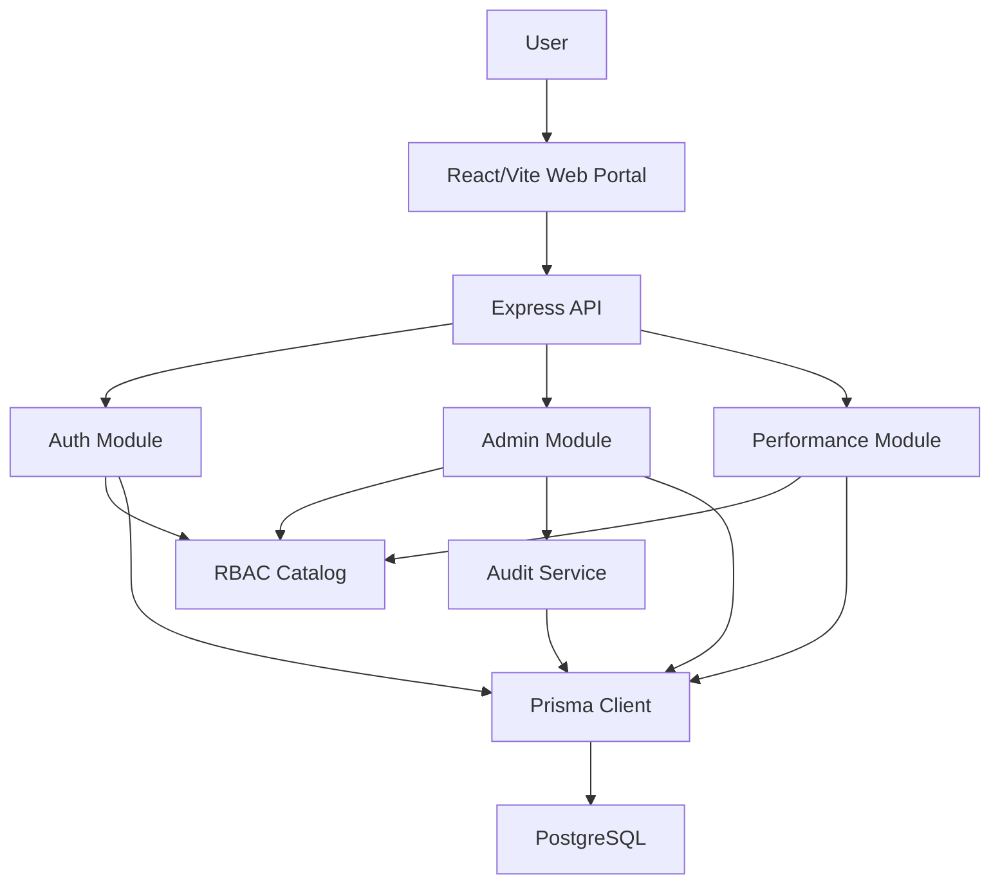

# SaaS HRMS - Phase 1 Implementation Architecture

Status: implementation contract  
Last reviewed: 2026-07-02  
Current repository stack: Express, Prisma, PostgreSQL, React, Vite, Vitest

This document defines what Phase 1 must be, what already exists in this repository,
what is intentionally out of scope, and what must be proven before release.

The goal is not to describe a large future platform. The goal is to keep the
current product operational, secure, testable, and extendable without pretending
that roadmap features are already production guarantees.

---

## 1. Grilling Verdict

The original architecture direction was good, but it was too broad for Phase 1.
It mixed MVP, future enterprise architecture, and optional platform features in
one document. That makes implementation risk higher because engineers cannot tell
which parts are mandatory now.

Phase 1 is now defined as:

- tenant-aware authentication
- tenant and organization administration
- user, role, permission, and assignment management
- performance management
- audit events for sensitive administration actions
- React web portal
- PostgreSQL-backed API
- automated backend and frontend verification gates

Everything else is roadmap unless promoted by an explicit architecture decision
record.

---

## 2. Current Implemented System

### Backend

- Runtime: Node.js with Express
- Language: TypeScript, ESM
- ORM: Prisma
- Database: PostgreSQL
- Auth: JWT access tokens plus refresh-token sessions
- Password hashing: Argon2
- Validation: Zod
- Logging: Pino HTTP
- Security middleware: Helmet, CORS allowlist, cookie parser
- Tests: Vitest

Current backend modules:

- `src/modules/auth`
- `src/modules/admin`
- `src/modules/performance`
- `src/modules/audit`
- `src/modules/rbac`

Current API roots:

- `GET /health/live`
- `/api/v1/auth`
- `/api/v1/admin`
- `/api/v1/performance`

### Frontend

- Runtime: React with Vite
- Language: TypeScript
- Routing: React Router
- Data fetching: TanStack Query
- Forms: React Hook Form and Zod
- State: Zustand
- UI primitives: local shared components with Radix where needed
- Tests: Vitest and Testing Library

Current frontend features:

- authentication
- dashboard
- admin pages
- performance page
- self-service pages
- shell/not-found routing

### Data Model

The implemented Prisma schema includes:

- tenants
- users
- tenant memberships
- roles
- permissions
- role permissions
- role assignments
- organizations
- generic HRMS records
- performance cycles, goals, KRAs, KPIs, reviews, and evidence
- auth sessions
- password reset tokens
- audit events
- deleted-user archives

---

## 3. Phase 1 Scope

### Mandatory For Phase 1

Phase 1 must support:

1. Platform super admin login.
2. Tenant-scoped organization users.
3. Tenant membership validation on authenticated requests.
4. Role and permission based authorization.
5. Organization scoped access where applicable.
6. Tenant and organization administration.
7. User administration including create, update, activate, deactivate, reset
   password, assign roles, and delete/archive.
8. Performance review cycles, goals, KRAs, KPIs, reviews, and evidence links.
9. Request IDs and correlation IDs.
10. Structured error responses.
11. Audit events for security-relevant administration workflows.
12. Backend and frontend automated tests.
13. Backend and frontend production builds.

### Explicitly Out Of Scope For Phase 1

These are not Phase 1 deliverables unless moved into scope by an ADR:

- mobile app
- GraphQL
- Kafka
- RabbitMQ
- OpenSearch
- OLAP warehouse
- Kubernetes
- SAML
- SCIM
- payroll
- recruitment
- training
- full attendance
- leave management
- dedicated database per tenant
- schema per tenant
- per-tenant KMS keys
- custom domain automation
- billing automation
- advanced workflow engine

This is deliberate. A smaller verified product is better than a large unverified
platform description.

---

## 4. Architecture



### Design Rule

This is a modular monolith. Do not split services in Phase 1.

Module boundaries are enforced by code ownership, routing boundaries, service
interfaces, and tests. A module must not reach into another module's private
implementation. Shared concerns belong in `src/core` or a clearly named module
such as `rbac` or `audit`.

---

## 5. Module Ownership

| Module | Owns | Does Not Own |
|---|---|---|
| Auth | login, refresh, logout, current user, password reset, MFA plumbing | tenant administration |
| Admin | tenants, organizations, users, roles, assignments | password hashing internals |
| RBAC | permission catalog and access semantics | direct route handlers |
| Audit | append-only security event recording | business authorization decisions |
| Performance | cycles, goals, KRAs, KPIs, reviews, evidence | global user lifecycle |
| Core | config, DB client, errors, request context, auth middleware | business workflows |

Rule: if a new feature needs tenant, user, role, or organization behavior, check
the existing module owner before adding new tables or service functions.

---

## 6. Tenancy Model

### Current Phase 1 Tenancy

Phase 1 uses pooled tenancy:

- shared database
- shared schema
- tenant identifiers in tenant-owned records
- application-level tenant validation
- tenant memberships tied to users
- tenant and organization scoped role assignments

Current implementation relies on application-level controls through auth,
tenant access middleware, service filters, and integration tests.

### Required Hardening Before Enterprise Release

Application-level tenant checks are not enough for enterprise-grade isolation.
Before regulated or high-risk tenants are onboarded, add PostgreSQL Row Level
Security to tenant-owned tables.

Required RLS rules:

1. Every tenant-owned table has `tenant_id`.
2. RLS is enabled and forced.
3. The application database role cannot bypass RLS.
4. Tenant context is set inside the transaction before any tenant query.
5. Background jobs set tenant context before database access.
6. Integration tests prove tenant A cannot read or write tenant B data.
7. Super admin elevated access is explicit and audited.

Example policy:

```sql
ALTER TABLE organizations ENABLE ROW LEVEL SECURITY;
ALTER TABLE organizations FORCE ROW LEVEL SECURITY;

CREATE POLICY tenant_isolation_organizations
ON organizations
USING (tenant_id = current_setting('app.tenant_id')::uuid)
WITH CHECK (tenant_id = current_setting('app.tenant_id')::uuid);
```

If PgBouncer is introduced, use a strategy that does not leak tenant session
state between requests. Prefer transaction-scoped tenant context.

---

## 7. Authorization Model

Authorization is permission based. Roles are containers for permissions.

Permission shape:

```text
<module>.<resource>.<action>
```

Examples:

- `admin.tenants.read`
- `admin.users.create`
- `admin.users.update`
- `admin.roles.assign`
- `performance.cycles.read`
- `performance.reviews.update`

Access must combine:

- authenticated user
- active session
- active tenant membership unless platform admin
- active role assignment
- permission code
- assignment scope
- optional MFA requirement

Scope types:

- `PLATFORM`
- `TENANT`
- `ORGANIZATION`
- `TEAM`
- `SELF`

No route should rely on role name alone. Role names are labels; permission codes
and scopes are enforceable policy.

---

## 8. Security Requirements

### Already Present

- Helmet headers
- CORS allowlist
- request JSON size limit
- JWT access token verification
- refresh-token session records
- refresh-token rotation tests
- Argon2 password hashing
- MFA claim support through authentication methods
- rate limiting on auth routes
- audit events for sensitive flows

### Required Before Public Production

1. Confirm `.env` is never committed.
2. Rotate any development secrets that have been shared outside a local machine.
3. Enforce secure cookies in production.
4. Add production CORS origins only.
5. Add database backup and restore runbook.
6. Add migration rollback procedure.
7. Add audit coverage map for every sensitive route.
8. Add account lockout and unlock admin flow review.
9. Add RLS hardening or document why the customer risk profile accepts app-level
   tenancy for the release.
10. Add dependency vulnerability scanning in CI.

---

## 9. API Contract Rules

Every new endpoint must define:

- route
- method
- required authentication
- required permission
- tenant behavior
- request schema
- response schema
- audit behavior
- error codes
- tests

Standard API behavior:

- JSON requests only unless the route explicitly supports file upload.
- Validation failures return structured client errors.
- Authentication failures return 401.
- Authorization failures return 403.
- Unknown routes return 404.
- Unexpected failures are logged and returned as sanitized errors.
- Request and correlation IDs are attached to responses.

---

## 10. Data Rules

Every new table must define:

- primary key
- tenant ownership, if applicable
- foreign keys
- unique constraints
- indexes
- soft-delete behavior
- audit requirements
- retention requirements
- owning module

Every tenant-owned query must include tenant filtering until RLS is implemented.
Super admin exceptions must be explicit in service code and covered by tests.

Soft-delete fields must be respected by default:

- `deleted_at`
- `deleted_by`

High-risk destructive operations should archive enough data to reconstruct what
was deleted.

---

## 11. Testing Contract

The project is not releasable unless these pass:

```powershell
pnpm verify
```

This command must cover:

- backend typecheck
- backend tests
- frontend typecheck
- frontend tests
- backend build
- frontend build

Minimum test coverage by risk:

| Risk Area | Required Tests |
|---|---|
| Auth | login, refresh rotation, logout, expired session, invalid token |
| RBAC | missing permission, wrong tenant, organization scope, platform admin |
| Tenant isolation | cross-tenant read/write rejection |
| Admin | create/update/deactivate/delete/archive user flows |
| Performance | cycle, goal, KRA, KPI, review state transitions |
| Audit | sensitive route emits audit event |
| Frontend | login flow, route guards, permission-gated screens |

No migration should be merged without either a test or a written manual
verification note.

---

## 12. Operational Readiness

### Required Environments

- local development
- test
- staging
- production

### Required Runtime Checks

- `/health/live` returns 200 when the API process is alive.
- Database migrations are applied before production start.
- Prisma client is regenerated after schema changes.
- Logs include request ID and correlation ID.
- Errors are sanitized in API responses.

### Required Runbooks

The `docs/runbooks` folder is the operational entry point:

- database and Prisma
- backend API
- frontend web
- auth module
- admin module
- performance module
- RBAC and audit
- development workflow

Runbooks must be updated in the same change as any operational behavior change.

---

## 13. Restore And Revert Strategy

Before risky edits:

1. Create a restore branch from the current HEAD.
2. Backup untracked documents that are part of the work.
3. Run verification before and after changes.

Restore branch created for this hardening pass:

```text
codex/restore-20260702-000050
```

Untracked architecture file backup created at:

```text
E:\SaaS HRMS\.codex-restore\20260702-000050\HRMS-SaaS-Architecture-Phase1.md
```

To inspect the restore branch:

```powershell
git show codex/restore-20260702-000050
```

To restore only this architecture file from backup:

```powershell
Copy-Item -LiteralPath 'E:\SaaS HRMS\.codex-restore\20260702-000050\HRMS-SaaS-Architecture-Phase1.md' -Destination 'E:\SaaS HRMS\HRMS-SaaS-Architecture-Phase1.md' -Force
```

Do not use destructive Git commands unless the exact target has been reviewed.

---

## 14. Roadmap

### Phase 1A - Stabilize Current Product

- keep current auth, admin, performance modules green
- add full audit coverage map
- add production deployment checklist
- add database backup/restore drill
- add dependency scan
- decide whether RLS is mandatory before first customer

### Phase 1B - HR Core Expansion

- employee profile module
- leave requests and approvals
- employee document storage
- notification service
- idempotency keys for critical mutations

### Phase 2 - Enterprise Readiness

- PostgreSQL RLS
- SAML or OIDC enterprise SSO
- SCIM provisioning
- custom domains
- stronger tenant lifecycle automation
- data export and retention workflows

### Phase 3 - Scale And Analytics

- outbox/event processing
- search index
- reporting projections
- warehouse/OLAP if operational data volume justifies it
- dedicated tenant isolation options

---

## 15. Non-Negotiable Engineering Rules

1. Do not add a new platform component without a clear operational owner.
2. Do not add a queue, search engine, warehouse, or microservice until the
   current monolith has a measured bottleneck.
3. Do not add a permission without adding it to the RBAC catalog and tests.
4. Do not add a tenant-owned query without tenant filtering or RLS.
5. Do not add a sensitive route without audit behavior.
6. Do not ship without `pnpm verify` passing.
7. Do not describe future roadmap features as current architecture.

This is how the project stays buildable instead of becoming a diagram.
