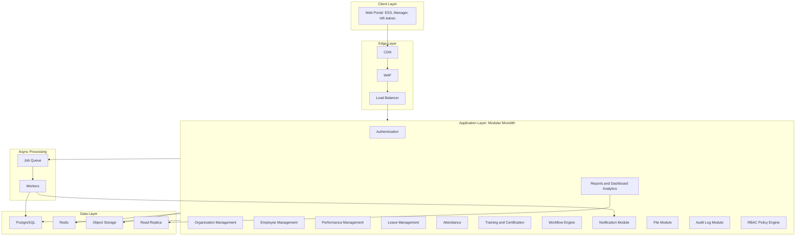
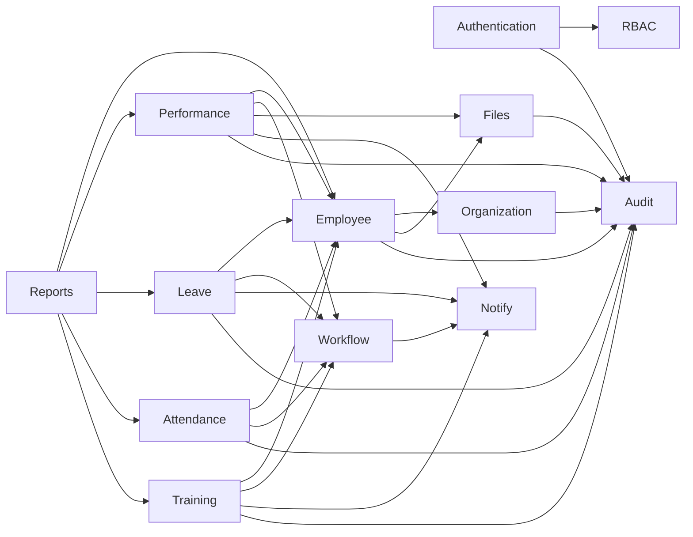

# SaaS HRMS Performance Management Architecture - Phase 1 Recommendation

This is a recommendation document, not implementation code. It is intentionally
biased toward a buildable Phase 1: modular monolith, strong tenant isolation,
clear RBAC, auditability, and operational simplicity.

## 1. System Architecture

Recommended Phase 1 shape: modular monolith with service-ready boundaries.

Do not start with microservices. HRMS has many workflow-heavy modules, but the
initial complexity is domain correctness, tenancy, RBAC, and auditability, not
independent service scaling. Split later only when a measured bottleneck or team
boundary justifies it.

Phase 1 runtime components:



Phase 1 mandatory:

- One web portal with role-driven navigation.
- One backend deployable with module boundaries.
- PostgreSQL as primary OLTP database.
- Redis for cache, rate limiting, and lightweight jobs if needed.
- Object storage for employee documents and performance evidence.
- Audit logging for sensitive actions.
- Notification jobs for email and in-app notifications.
- Reports served from OLTP/read replica first.

Defer:

- Mobile app.
- Kafka.
- Dedicated analytics warehouse.
- OpenSearch.
- Microservices.
- Kubernetes unless the hosting environment already mandates it.
- SAML/SCIM unless first customers require enterprise SSO.

Critical risk:

The platform will fail if RBAC and tenancy are treated as UI concerns. They must
be enforced in API middleware, service logic, database constraints, tests, and
audit logs.

## 2. Database Architecture

Recommended database: PostgreSQL.

Primary tenancy model for Phase 1: pooled tenancy with shared schema and
`tenant_id` on every tenant-owned table.

Core schema domains:

| Domain | Core Tables |
|---|---|
| Tenancy | `tenants`, `tenant_settings`, `tenant_feature_flags`, `subscriptions` |
| Identity | `users`, `tenant_memberships`, `auth_sessions`, `password_reset_tokens`, `mfa_factors` |
| RBAC | `roles`, `permissions`, `role_permissions`, `role_assignments` |
| Organization | `organizations`, `organization_closure`, `locations`, `designations` |
| Employee | `employees`, `employment_history`, `employee_documents`, `employee_custom_fields` |
| Performance | `review_cycles`, `goals`, `kras`, `kpis`, `performance_reviews`, `review_evidence` |
| Leave | `leave_types`, `leave_policies`, `leave_balances`, `leave_requests`, `holiday_calendars` |
| Attendance | `shifts`, `attendance_logs`, `timesheets`, `regularization_requests` |
| Training | `courses`, `certifications`, `enrollments`, `training_completions` |
| Workflow | `workflow_definitions`, `workflow_instances`, `workflow_steps`, `approval_actions` |
| Notification | `notification_templates`, `notification_events`, `notification_deliveries`, `notification_preferences` |
| Files | `file_objects`, `file_access_grants`, `file_scan_results` |
| Audit | `audit_events` |
| Reports | `report_snapshots`, `dashboard_metrics` |

Database conventions:

- Every tenant-owned table has `tenant_id uuid not null`.
- Every tenant-owned table has indexes starting with `tenant_id`.
- Use UUID primary keys.
- Use soft deletes for business records: `deleted_at`, `deleted_by`.
- Use append-only audit logs.
- Use optimistic concurrency for high-conflict records: `row_version`.
- Store custom tenant fields in controlled JSONB columns, not arbitrary schema
  changes per tenant.
- Keep PII fields explicit and documented.
- Partition high-volume tables later: `audit_events`, `attendance_logs`,
  `notification_deliveries`.

Recommended Phase 1 indexes:

- `(tenant_id, id)` on tenant-owned tables.
- `(tenant_id, deleted_at)` where soft deletes exist.
- `(tenant_id, status, deleted_at)` for workflow records.
- `(tenant_id, employee_id, status)` for performance, leave, attendance.
- `(tenant_id, occurred_at)` for audit events.
- `(tenant_id, entity_type, entity_id, occurred_at)` for audit lookup.

Critical risk:

Do not design employee data as one generic `records` table for everything.
Generic records are tempting, but HRMS needs durable contracts around employee,
leave, attendance, and performance workflows. Use explicit tables for core
workflows and JSONB only for controlled extensions.

## 3. Module Dependency Diagram

Allowed dependency direction:



Rules:

- `Authentication` owns identity and sessions.
- `RBAC` owns permission definitions and scope semantics.
- `Organization` owns hierarchy and organization scope.
- `Employee` is the central HR subject module.
- Performance, Leave, Attendance, and Training depend on Employee.
- Performance, Leave, Attendance, and Training must not depend on each other
  directly.
- Workflow is shared infrastructure, not a business owner.
- Reports is read-only. It must not write back into business modules.
- Audit receives events. It does not decide authorization.

Forbidden:

- UI-only authorization.
- Cross-module direct table mutation.
- Business modules writing directly to report snapshots except through a
  reporting interface or event/projection process.
- Workflow engine owning business meaning. It only owns state transitions and
  approval mechanics.

Critical risk:

The module diagram must be enforced by code review, import boundaries, tests, and
data ownership rules. A diagram without enforcement will decay quickly.

## 4. Tenant Isolation Strategy

Recommended Phase 1 strategy: pooled tenancy with explicit path to PostgreSQL
Row Level Security.

Tenant resolution:

- Resolve tenant from subdomain, custom domain, or login organization selector.
- Store `tenant_id` in access token after login.
- Validate every request tenant against active membership.
- For platform admins, require explicit tenant context when operating inside a
  tenant.

Database isolation:

- Phase 1 minimum: every tenant query filters by `tenant_id`.
- Enterprise hardening: enable PostgreSQL RLS on tenant-owned tables.
- Application database role must not bypass RLS.
- Background jobs must carry `tenant_id` and set tenant context before database
  work.

File isolation:

- Store files under tenant-prefixed object keys.
- Never expose raw storage URLs directly.
- Use short-lived signed URLs.
- Scan uploads for malware.
- Store file metadata in database with `tenant_id`, owner, module, entity, size,
  MIME type, checksum, and scan status.

Cache isolation:

- Prefix keys: `tenant:{tenant_id}:...`
- Never cache cross-tenant data under global keys unless the data is genuinely
  platform-global.

Search and analytics isolation:

- Phase 1: avoid search engine unless needed.
- Reports must filter by tenant and scope.
- If search is introduced later, use per-tenant index or filtered alias.
- If warehouse is introduced later, include tenant partitioning and access
  policies.

Admin isolation:

- Super admin is a platform role, not a tenant role.
- Elevated access must be explicit and audited.
- Super admin actions should record `actor_user_id`, `effective_tenant_id`,
  entity, reason, IP, user agent, and request ID.

Critical risk:

Tenant isolation is not just database filtering. Files, queues, cache, logs,
reports, exports, and support tooling all need tenant boundaries.

## 5. RBAC Matrix

Use permissions, not role-name checks.

Role model:

| Role | Scope | Purpose |
|---|---|---|
| Platform Super Admin | Platform | Operates SaaS platform across tenants |
| Tenant Admin | Tenant | Owns tenant configuration and tenant-wide HR setup |
| HR Admin | Tenant or Organization | Manages HR operations |
| HR Manager | Organization | Manages HR processes for assigned organization |
| Manager | Team | Handles team approvals and reviews |
| Employee | Self | Employee self service |
| Auditor | Tenant or Organization | Read-only audit and compliance access |
| Integration | Tenant | Machine-to-machine integration access |

Permission examples:

| Module | Permission Examples |
|---|---|
| Auth | `auth.sessions.read`, `auth.sessions.revoke`, `auth.mfa.manage` |
| Tenant | `tenant.settings.read`, `tenant.settings.manage` |
| Organization | `organization.read`, `organization.create`, `organization.update`, `organization.delete` |
| Employee | `employee.read.self`, `employee.read.team`, `employee.read.all`, `employee.update.self`, `employee.update.all` |
| Performance | `performance.cycles.manage`, `performance.reviews.self`, `performance.reviews.team`, `performance.reviews.approve` |
| Leave | `leave.request.self`, `leave.request.team.read`, `leave.request.approve`, `leave.policy.manage` |
| Attendance | `attendance.own.read`, `attendance.team.read`, `attendance.records.manage`, `attendance.corrections.approve` |
| Training | `training.enroll.self`, `training.assign.team`, `training.catalog.manage` |
| Reports | `reports.own.read`, `reports.team.read`, `reports.tenant.read`, `reports.export` |
| Audit | `audit.read`, `audit.export` |
| Files | `files.upload`, `files.read`, `files.delete`, `files.grant` |
| Workflow | `workflow.config.manage`, `workflow.task.approve`, `workflow.task.delegate` |

Matrix:

| Module | Platform Super Admin | Tenant Admin | HR Admin | Manager | Employee | Auditor |
|---|---|---|---|---|---|---|
| Authentication | Full platform | Tenant users | Tenant users | Own session | Own session | Read session audit |
| Organization | Full | Full tenant | Manage assigned orgs | Read team org | Read own org | Read |
| Employee | Full | Full tenant | Manage assigned scope | Read team | Read/update self | Read |
| Performance | Full | Configure tenant | Manage cycles/reviews | Review team | Self review | Read |
| Leave | Full | Configure policies | Manage leave | Approve team | Request leave | Read |
| Attendance | Full | Configure policies | Manage records | Review team | Own attendance | Read |
| Training | Full | Configure catalog | Assign/manage | Assign team | Enroll self | Read |
| Reports | Full | Tenant reports | HR reports | Team reports | Own reports | Read/export |
| Audit | Full | Tenant audit | Limited HR audit | None | None | Read/export |
| Workflow | Full | Configure workflows | Participate/manage | Approve team | Participate | Read |
| Files | Full | Tenant files | HR files | Team files | Own files | Read |

Critical risk:

Do not let Tenant Admin create tenant-wide roles freely from the UI. Custom roles
should be organization-bound unless the actor is a platform admin or an explicit
tenant-wide role-management workflow exists.

## 6. API Architecture

Recommended API style: REST first, OpenAPI documented.

API conventions:

- Versioned routes: `/api/v1/...`
- JSON request/response bodies.
- Problem-details style errors with stable `error_code`.
- Cursor pagination for lists.
- Idempotency keys for critical mutations.
- Request ID and correlation ID on every request.
- Tenant context from token plus optional explicit tenant header for platform
  admins.

Authentication:

- Access token: short-lived JWT.
- Refresh token: opaque, hashed in database, rotated on use.
- MFA support for sensitive permissions.
- Session revocation on password change, logout, admin action, and refresh-token
  reuse.

Authorization:

- Route guard checks coarse permission.
- Service layer checks tenant and organization scope.
- Database constraints enforce ownership.
- Tests prove cross-tenant and cross-organization access is blocked.

Suggested route groups:

| Route Group | Purpose |
|---|---|
| `/api/v1/auth` | login, refresh, logout, current user, password reset, MFA |
| `/api/v1/admin/tenants` | tenant settings and lifecycle |
| `/api/v1/admin/organizations` | organization hierarchy |
| `/api/v1/admin/users` | user and membership management |
| `/api/v1/admin/roles` | roles, permissions, assignments |
| `/api/v1/employees` | employee profiles, documents, employment history |
| `/api/v1/performance` | cycles, goals, KRAs, KPIs, reviews, evidence |
| `/api/v1/leave` | leave policies, balances, requests |
| `/api/v1/attendance` | shifts, logs, timesheets, corrections |
| `/api/v1/training` | catalog, certifications, enrollments |
| `/api/v1/workflows` | definitions, instances, approval tasks |
| `/api/v1/files` | upload, signed URL, metadata, access grants |
| `/api/v1/reports` | dashboards, exports, snapshots |
| `/api/v1/audit` | audit search and export |

Notifications:

- API writes notification intent.
- Worker sends email/in-app notifications.
- Store delivery attempts and failures.
- Templates are tenant-aware.

Webhooks:

- Defer until integrations need them.
- When added, sign payloads and retry with dead-letter handling.

Critical risk:

Do not put all access control in middleware. Middleware cannot know every row and
workflow state. Service-level authorization is mandatory.

## 7. Folder Structure

Recommended modular monolith structure:

```text
hrms-saas/
  apps/
    api/
      src/
        core/
          config/
          db/
          errors/
          logging/
          request-context/
          validation/
        modules/
          auth/
          tenancy/
          organization/
          employee/
          performance/
          leave/
          attendance/
          training/
          reports/
          workflow/
          notification/
          files/
          audit/
          rbac/
    web/
      src/
        app/
        layouts/
        features/
          auth/
          dashboard/
          admin/
          employee/
          performance/
          leave/
          attendance/
          training/
          reports/
          self-service/
        shared/
          api/
          forms/
          ui/
          lib/

  packages/
    permissions/
    tenant-context/
    validators/
    event-contracts/

  prisma/
    schema.prisma
    migrations/
    seed.ts

  docs/
    architecture/
    api/
    runbooks/
    decisions/

  tests/
    auth/
    rbac/
    tenancy/
    admin/
    performance/
    integration/

  infra/
    docker/
    terraform/
    ci/
```

Rules:

- Keep modules flat until complexity justifies subfolders.
- Each backend module owns routes, schemas, controller, service, and tests.
- Shared code must not contain business workflows.
- RBAC catalog should be centrally owned.
- Tenant context helpers should be centrally owned.
- Frontend features should mirror product areas, not backend tables.
- Runbooks must be updated when runtime behavior changes.

Critical risk:

Avoid a folder named `services/` if the app is a modular monolith. It creates
confusion and encourages premature microservice thinking. Use `modules/` inside
one API app unless services are truly independently deployed.
