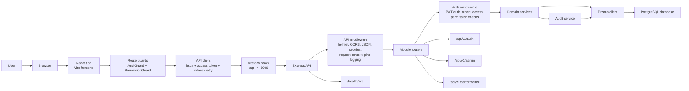
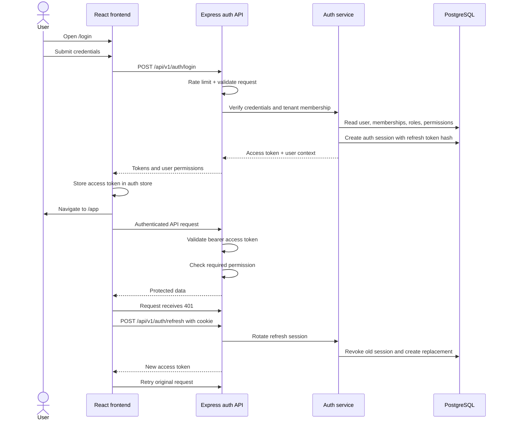
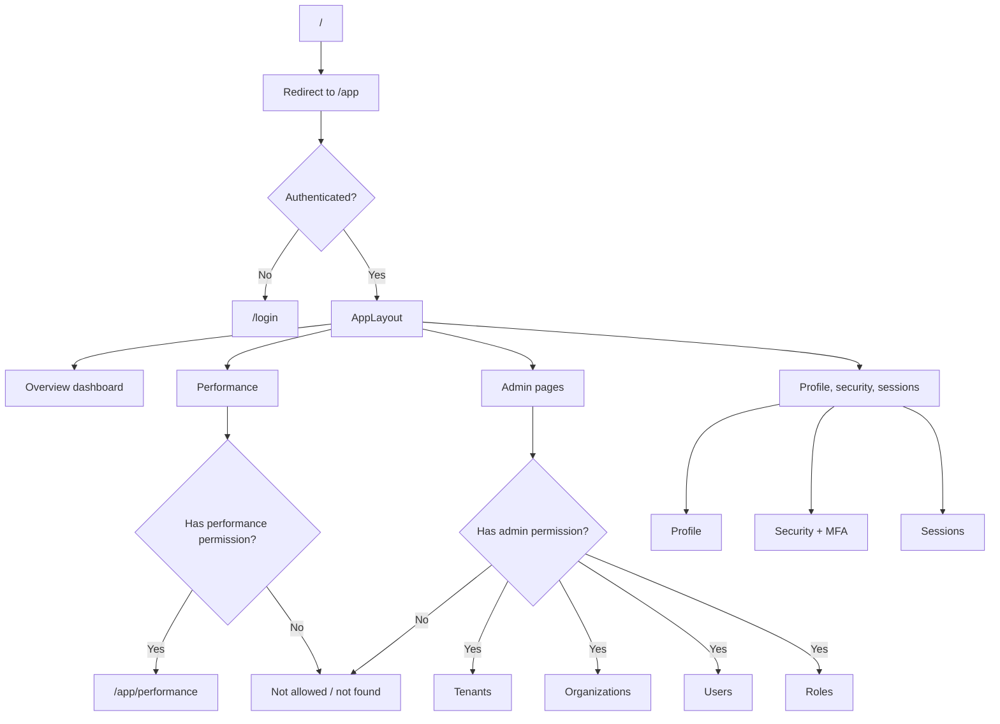
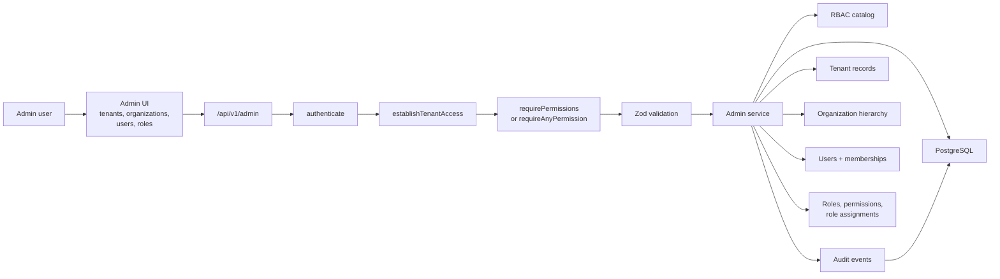
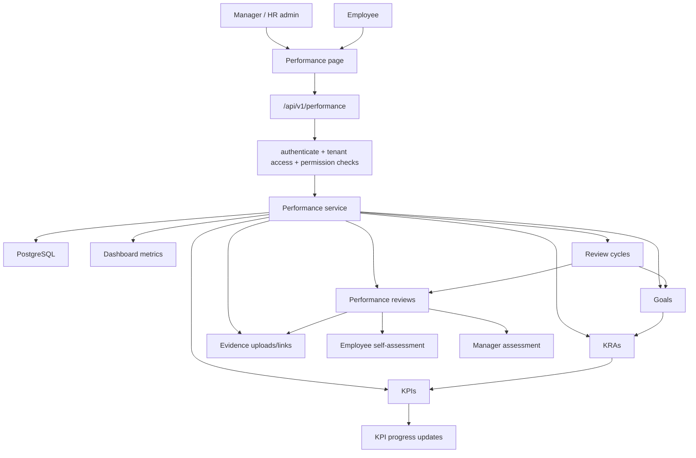
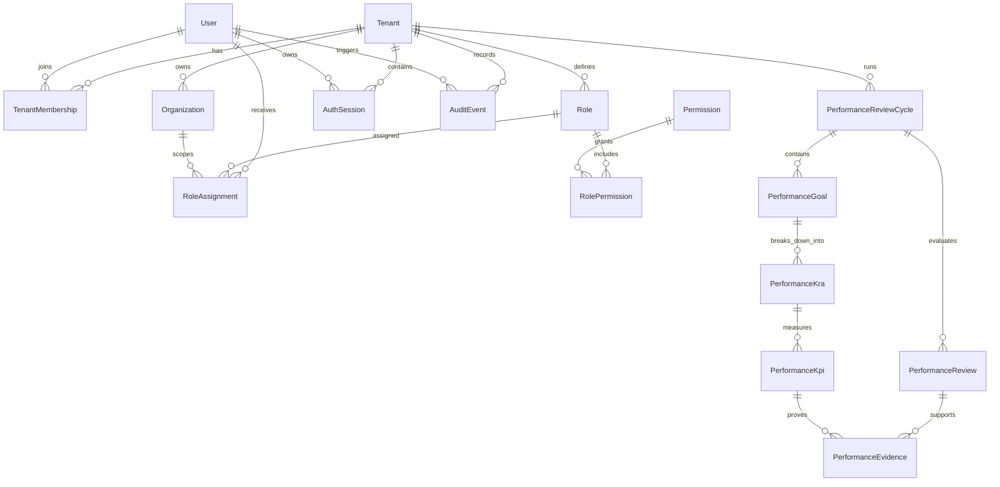

# SaaS HRMS Project Flow

This document maps the main runtime and product flows for the SaaS HRMS Performance Management project.

## System Flow

## Authentication And Session Flow

## Frontend Navigation Flow

## Admin And RBAC Flow

## Performance Management Flow

## Data Domain Map

